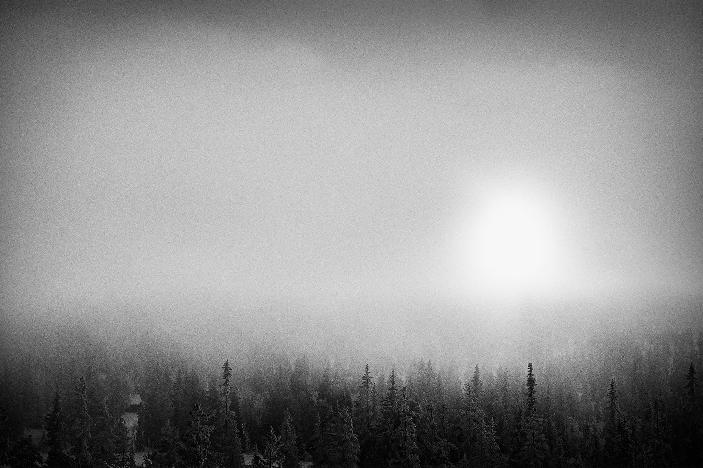

import { Image } from 'astro:assets';

    <b>Project Name:</b> Sunset 
    <b>Client:</b> Personal project 
    <b>Direction:</b> - 
    <b>Software Used:</b> Capture One and Photoshop 
    <b>Description:</b> Sun is setting in the mist of snowproduction in Sälen, Sweden, captured in 2018.

<figure data-lightbox="true">
    
</figure>

<a href="https://www.etsy.com/se-en/shop/BlackAndWhitePost">Sunset - Etsy shop link</a>.
