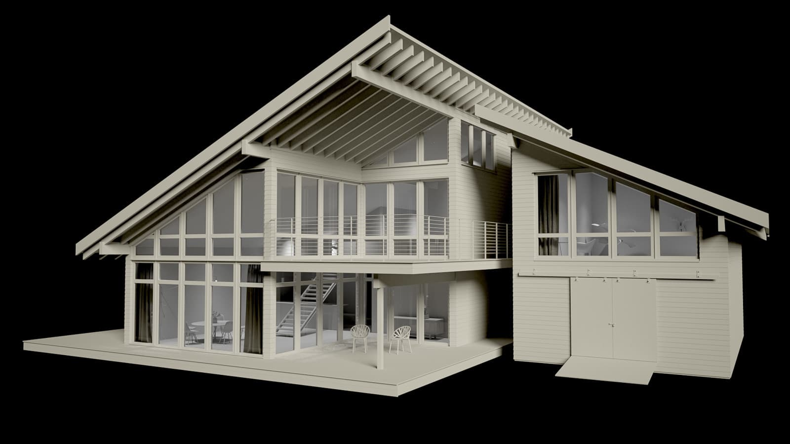
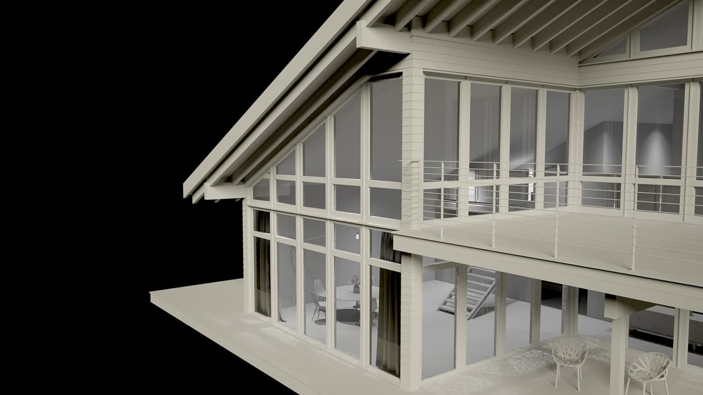
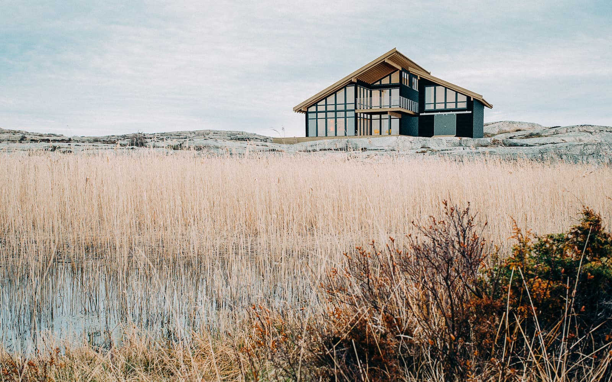

import { Image  } from 'astro:assets';

    <b>Project Name:</b> West coast house 
    <b>Client:</b> Personal project 
    <b>Direction:</b> Visualize an exclusive house on the rocks of Bohuslän, Sweden. With an grand view of the ocean. 
    <b>Software Used:</b> Autodesk Maya, Arnold Renderer, Adobe Photoshop 
    <b>Description:</b> I wanted to photograph a nice background for my 3D model, so I went to the west coast of Sweden and then I photomatched the 3D scene to the photograph. Finished the scene with texturing and then I rendered it out in Maya / Arnold. Did the mattepainting in Photoshop. 

<figure data-lightbox="true">
    
    <figcaption>Raw 3D model screenshoot.</figcaption>
</figure>

<figure data-lightbox="true">
    
    <figcaption>Raw 3D model screenshoot.</figcaption>
</figure>

<figure data-lightbox="true">
    
    <figcaption>Final CG image.</figcaption>
</figure>