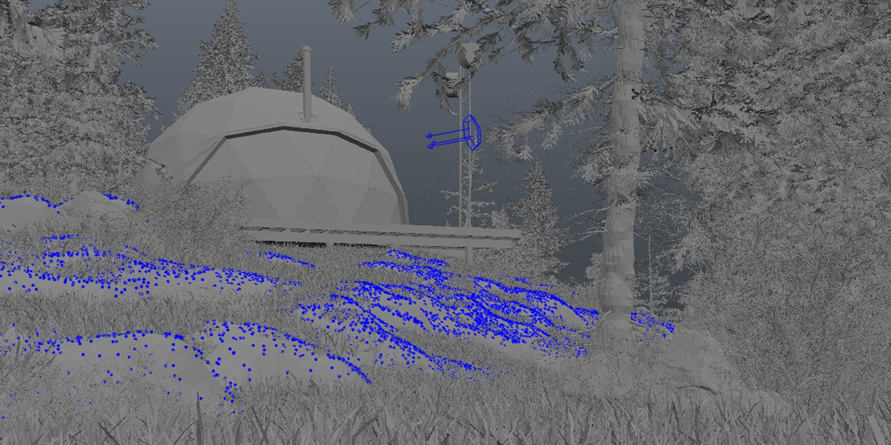
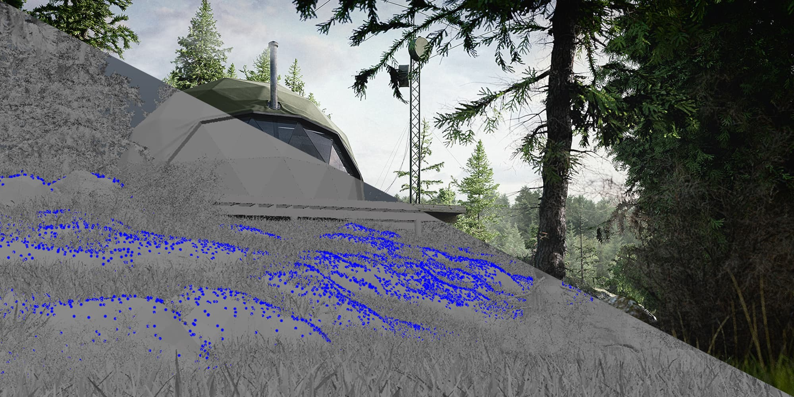
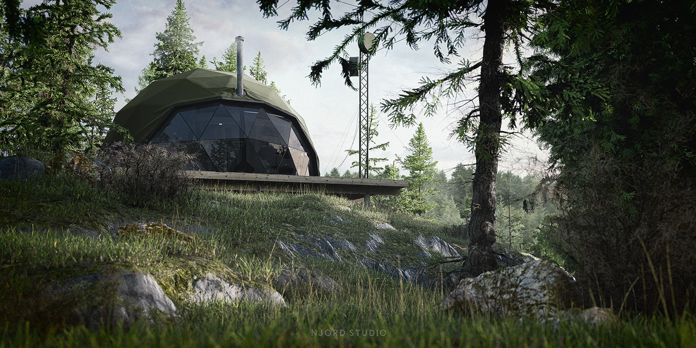

import { Image  } from 'astro:assets';

    <b>Project Name:</b> Storm cabin 
    <b>Client:</b> Personal project 
    <b>Direction:</b> Expedition outpost in the highlands of the north of Sweden. 
    <b>Software Used:</b> Blender, Marvelous Designer, Clarisse, Photoshop 
    <b>Description:</b> I wanted to make an environment with Clarisse and Marvelous Designer. To get som organics in to my archvis work. Also with some storytelling. 

<figure data-lightbox="true">
    
    <figcaption>Raw 3D model screenshoot.</figcaption>
</figure>

<figure data-lightbox="true">
    
    <figcaption>Split of Final image and raw 3D model screenshoot.</figcaption>
</figure>

<figure data-lightbox="true">
    
    <figcaption>Final CG image.</figcaption>
</figure>