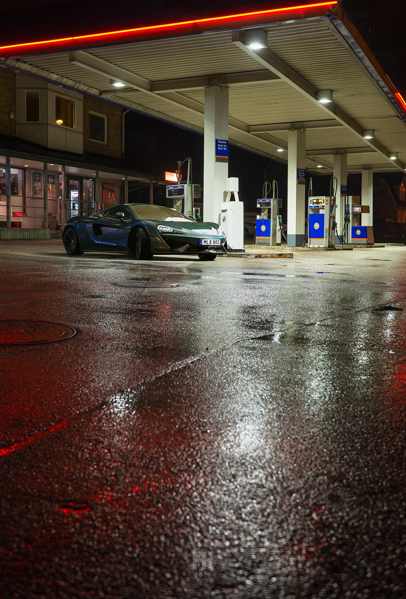

import { Image  } from 'astro:assets';

<b>Project Name:</b> Refuel 
<b>Client:</b> Personal project 
<b>Direction:</b> Make an CG image with custom HDRI backplate and environment. 
<b>Software Used:</b> Modo, V-Ray, PT Gui, Photoshop 
<b>Description:</b> I wanted to make an environment with an HDRI and Backplate image of my own creation, render in a car (I have not modeled this car) with custom materials and try V-ray Renderer. 

<figure data-lightbox="true">
    
    <figcaption>Final CG image.</figcaption>
</figure>