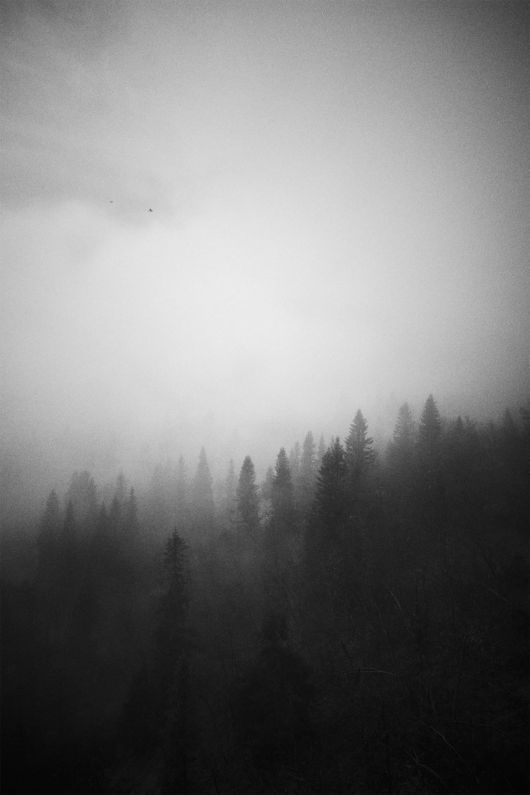

import { Image } from 'astro:assets';

<b>Project Name:</b> Skadi’s Domain 
<b>Client:</b> Personal project 
<b>Direction:</b> - 
<b>Software Used:</b> Capture One and Photoshop 
<b>Description:</b> Skadi’s Domain – Named after Skadi, the Norse goddess of winter and mountains. Captured in 2024 Åre, Sweden. 

<figure data-lightbox="true">
    
</figure>

<a href="https://www.etsy.com/se-en/shop/BlackAndWhitePost">Skadi’s Domain - Etsy shop link</a>.
