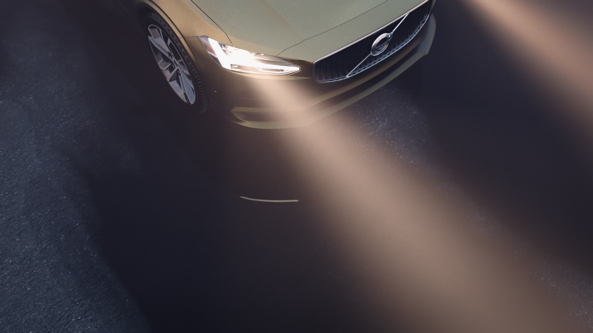
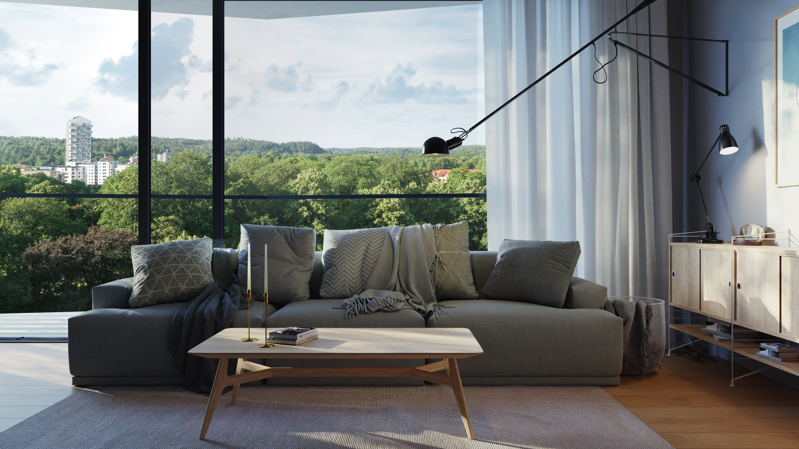
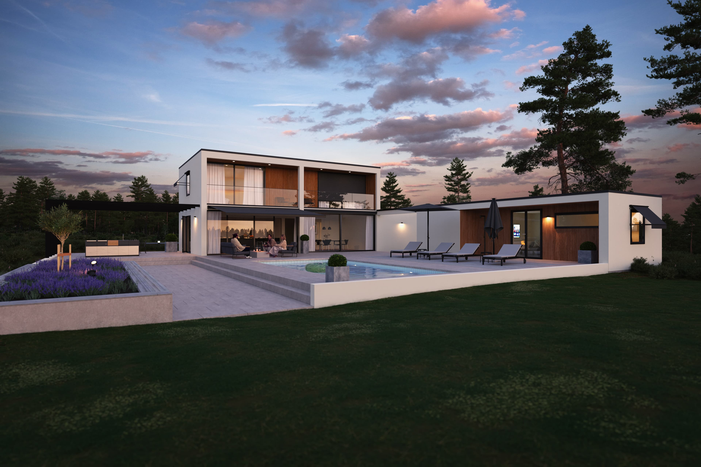
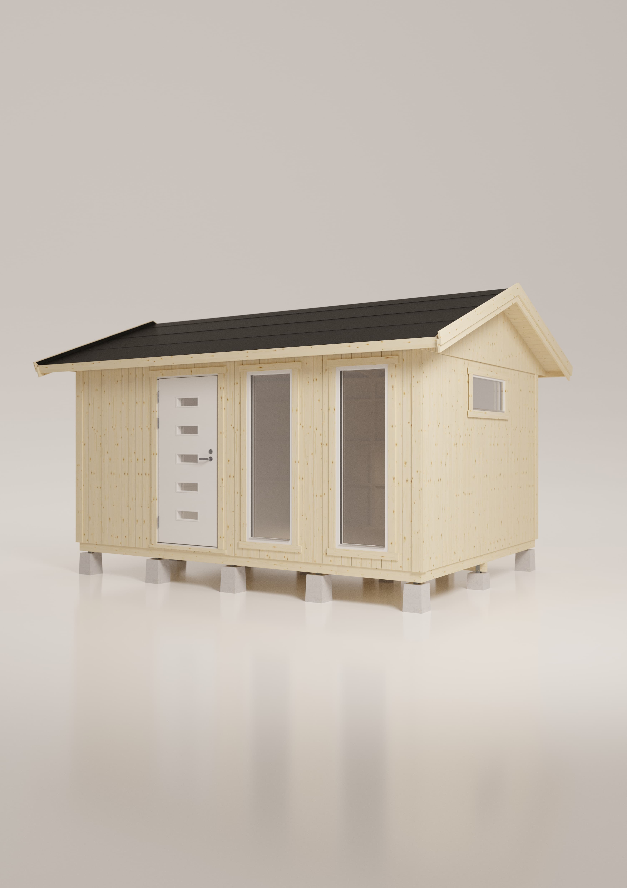

import { Image  } from 'astro:assets';

<b>Project Name:</b> Various 
<b>Client:</b> Various for <a href="https://www.r-3.se/">R3 advertising agency</a> 
<b>Direction:</b> Photorealistic visualisation. 
<b>Software Used:</b> Blender, Photoshop. 
<b>Description:</b> This is a couple of random images I did at R3 Adventising Agency. 

<figcaption>Final CG image.</figcaption>

<figcaption>Final CG image.</figcaption>

<figcaption>Final CG image for SunOff.</figcaption>

<figcaption>Final CG image for VIBO.</figcaption>