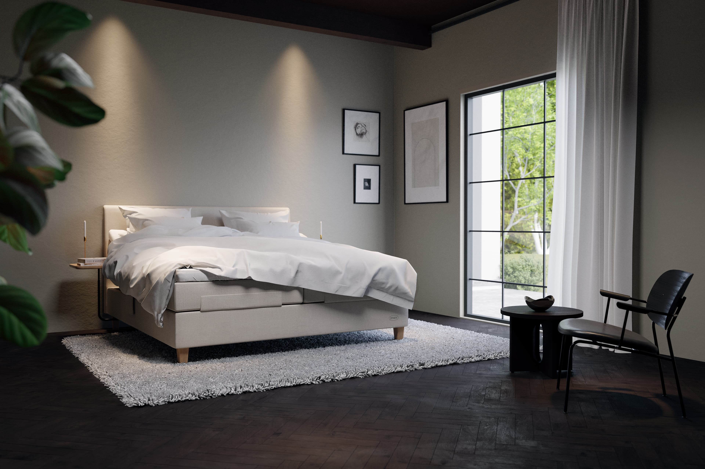
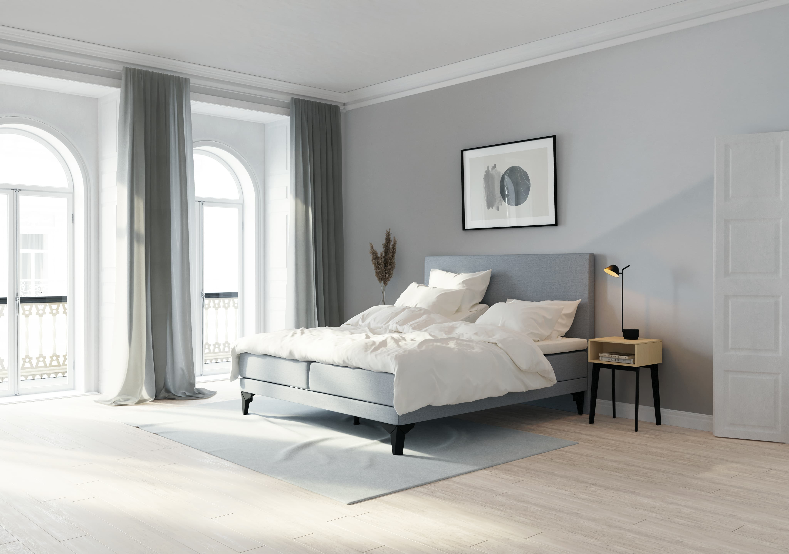
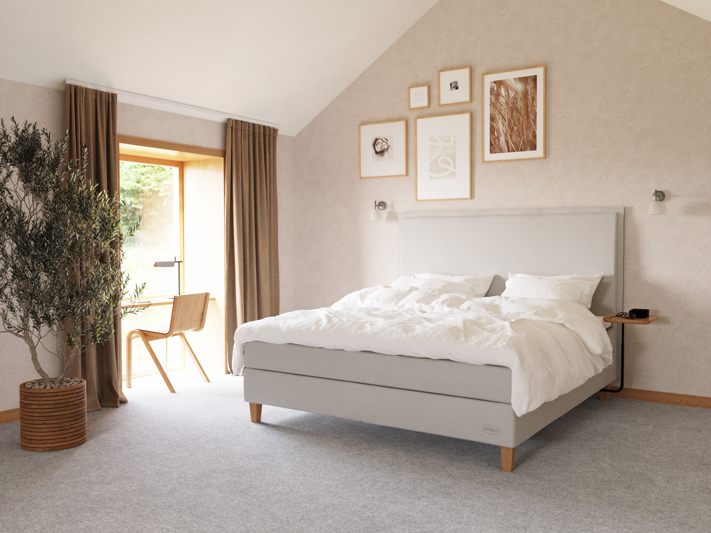
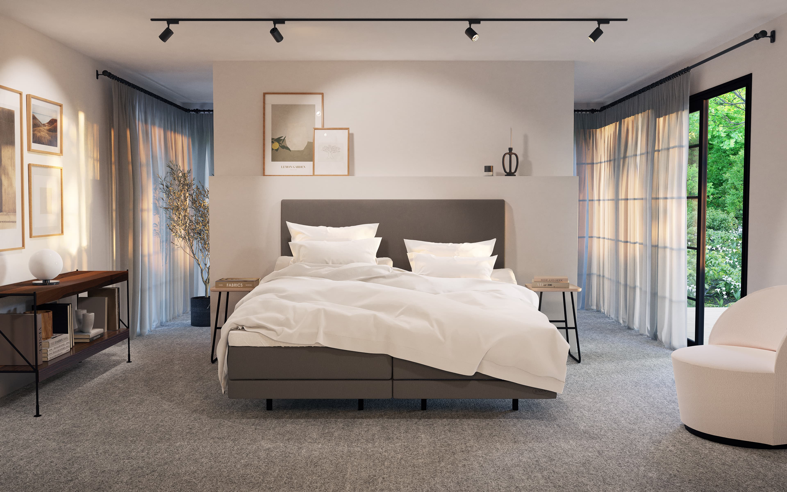
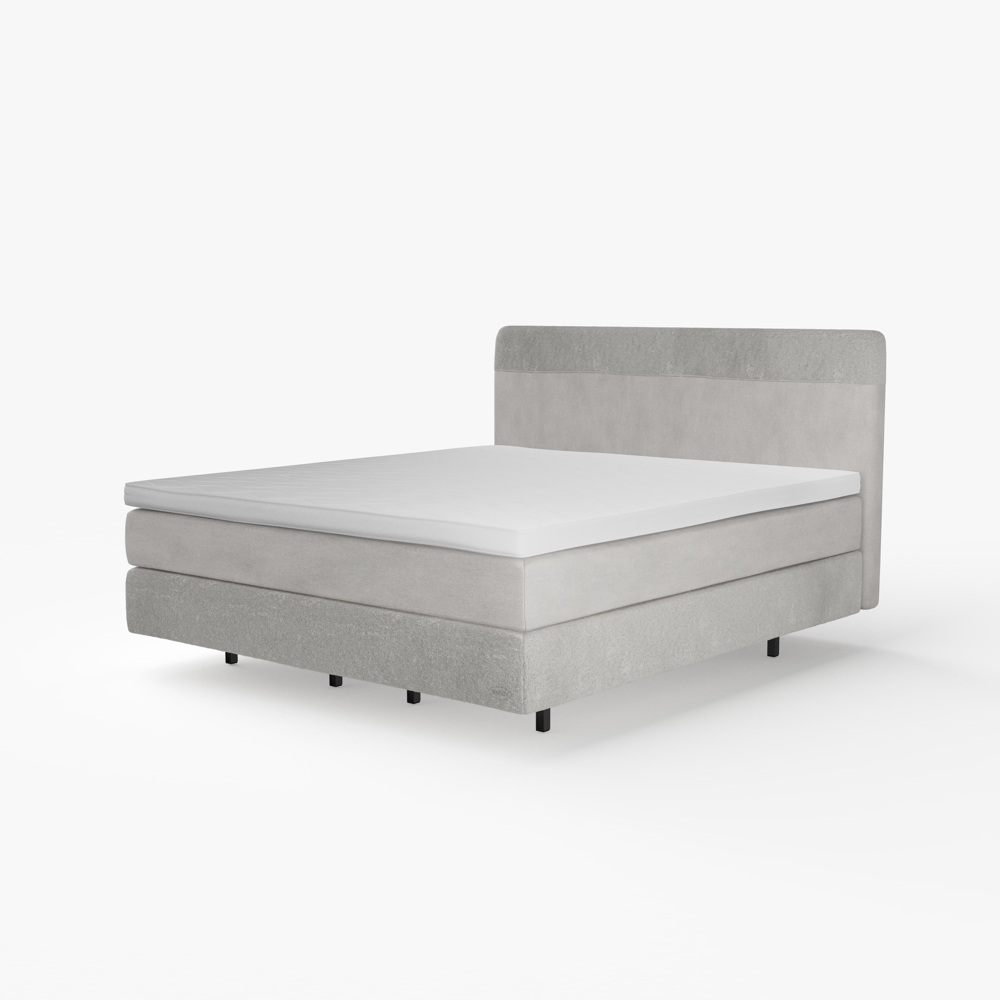
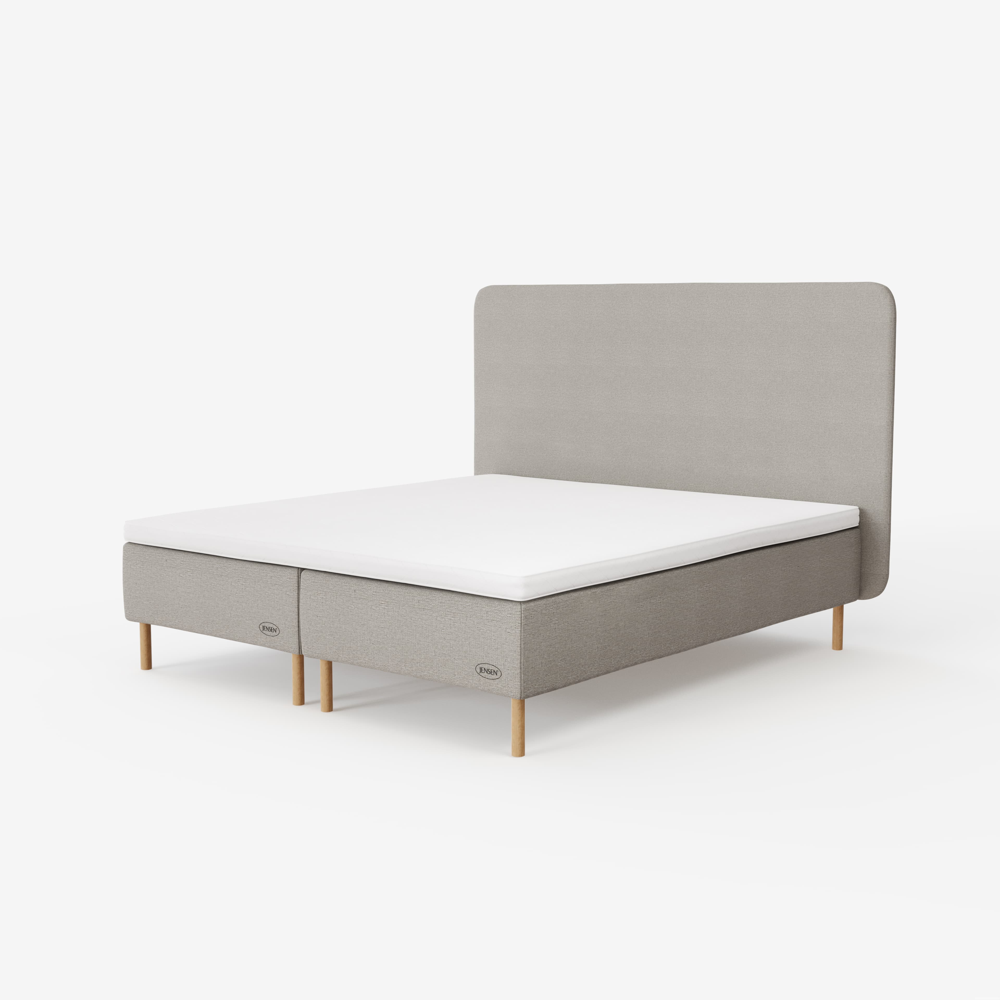
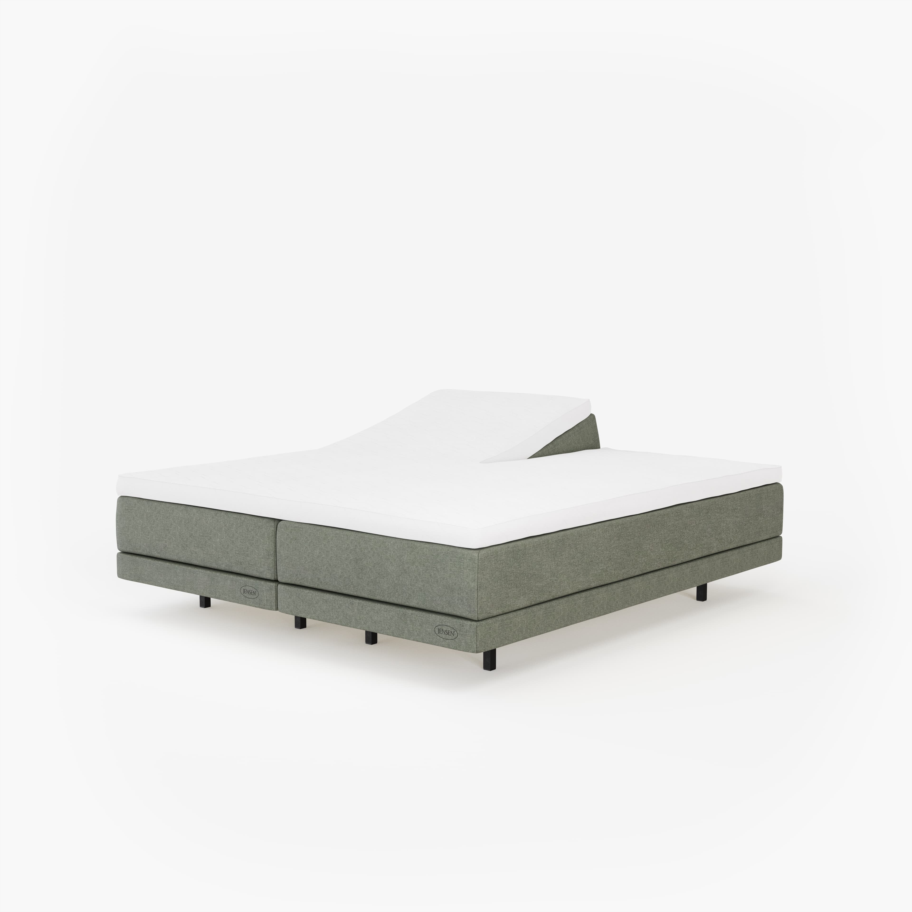
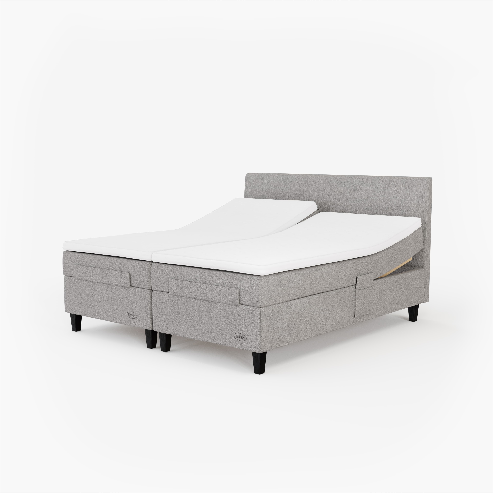

import { Image  } from 'astro:assets';

<b>Project Name:</b> Jensen 
<b>Client:</b> Jensen for <a href="https://www.r-3.se/">R3 advertising agency</a> 
<b>Direction:</b> Photorealistic visualisation of Jensen beds in environment. 
<b>Software Used:</b> Blender, Marvelous Designer, Photoshop. 
<b>Description:</b> This is a couple of images I did at R3 Adventising Agency for their client Jensen Beds. 

<figcaption>Full CG environment.</figcaption>

<figcaption>Full CG environment.</figcaption>

<figcaption>Full CG environment.</figcaption>

<figcaption>Full CG environment.</figcaption>

<figcaption>Final CG image.</figcaption>

<figcaption>Final CG image.</figcaption>

<figcaption>Final CG image.</figcaption>

<figcaption>Final CG image.</figcaption>