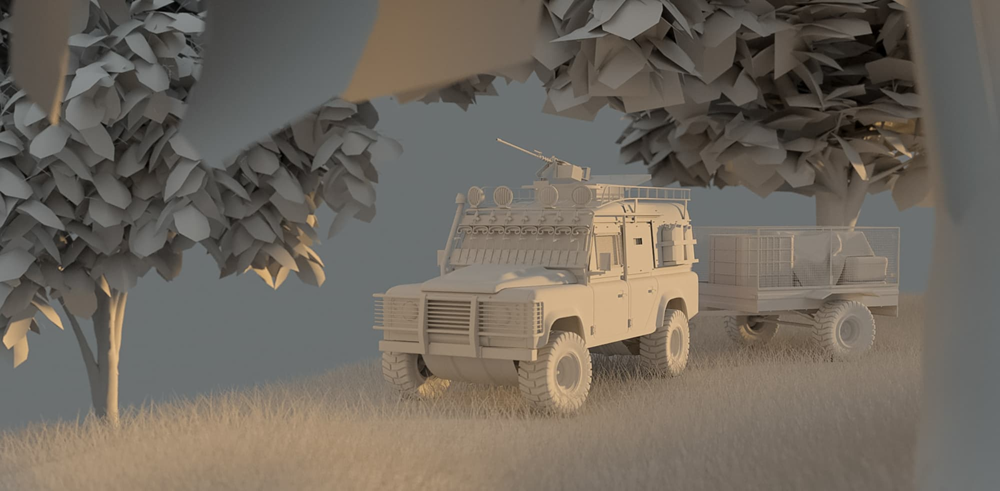
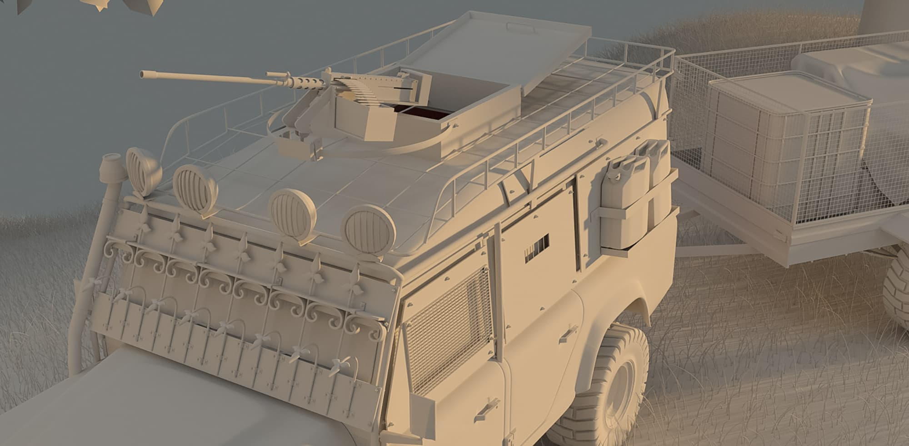

import { Image  } from 'astro:assets';

    <b>Project Name:</b> Defender of the north 
    <b>Client:</b> Personal project 
    <b>Direction:</b> Make a concept of an viechle in a fallen north, makeshift protection and armed. 
    <b>Software Used:</b> Autodesk Maya, V-Ray, Photoshop 
    <b>Description:</b> I wanted to make a 3D concept of an fallen world, where the people in the world took what they could and managed to survive the hordes of brutalism that comes when there is no structure and food anymore. 

<figure data-lightbox="true">
    
    <figcaption>Greybox 3D scene.</figcaption>
</figure>

<figure data-lightbox="true">
    
    <figcaption>Greybox 3D scene close.</figcaption>
</figure>

<figure data-lightbox="true">
    
    <figcaption>Full CG environment.</figcaption>
</figure>